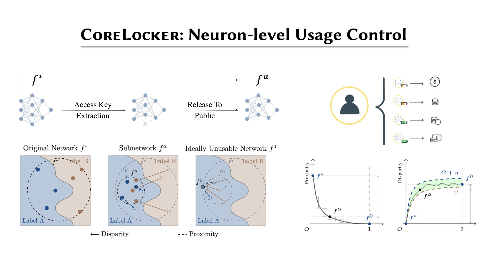
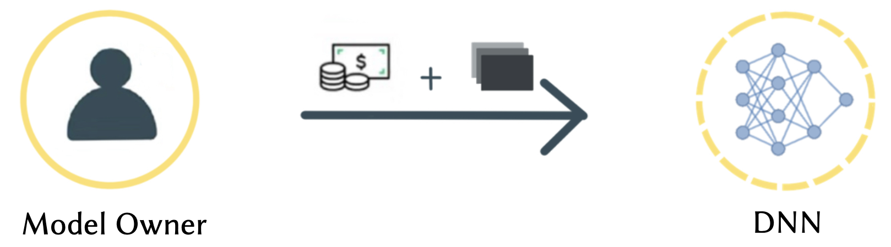
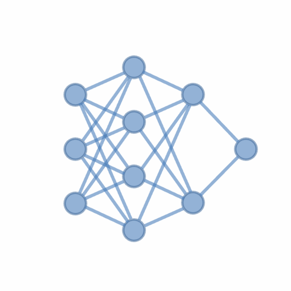
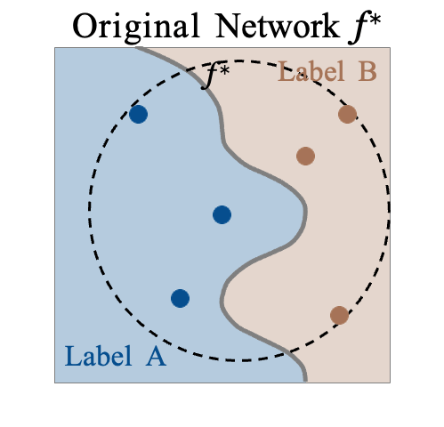
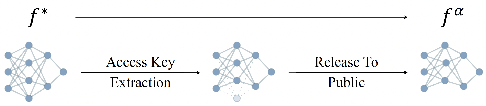
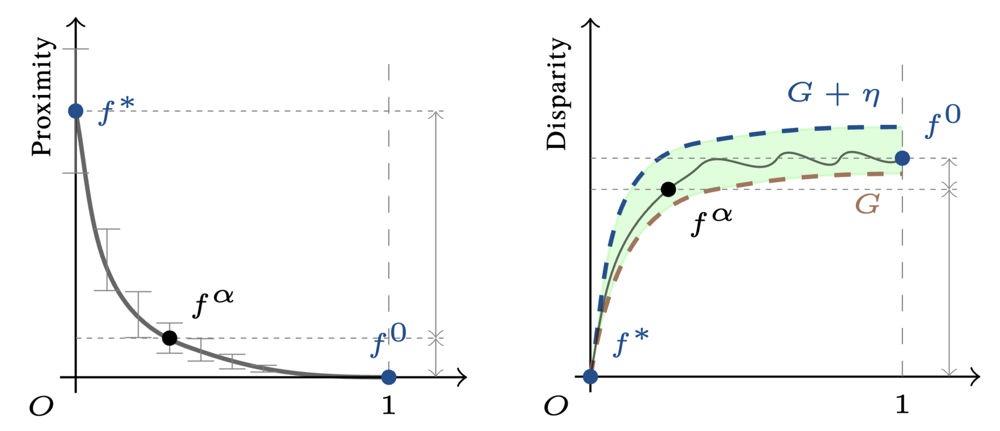

<head>
    
    
    
</head>

# Neuron-level Usage Control [<i>S&P'24</i>]

    

## Background
Deep neural networks (DNNs) have seen remarkable success in various fields, yet developing a high-quality model often demands substantial resources.
This includes sophisticated architectural design, extensive high-quality data, meticulous fine-tuning, and optimization, and substantial computational power. Taking GPT-3 as an example, it consists of 175 billion parameters and takes 355 GPU-years and \$4.6M for a single training run. A model thus represents a valuable intellectual property (IP), and transforms into a treasure of its developer. For instance, a recent study by Fortune shows that ChatGPT has attracted 100 million active users two months after its launch, and earns 80 million dollars per month for OpenAI. 

    

In contrast to the traditional deployment of DNN models within the server or cloud under the direct control of the model owner, various scenarios, such as commercial partnerships, consulting services, and on-device inference, entail the transfer of the model to an external party, referred to as the *model controller*. Nevertheless, once the model is handed over to the model controller, the owner loses control over it. Indeed, a recent study on 1,468 mobile apps uncovers that 41% of them fail to secure their DNN models against on-device model inference attacks, allowing the attacker to extract all model parameters through reverse engineering. Consequently, unethical controllers may exploit the obtained model for unscrupulous competition or unauthorized subletting, posing financial losses for the model owners. Moreover, malicious controllers can abuse the model to facilitate the generation of adversarial examples to attack the model owner's legitimate services. 

    

Two lines of research are seemingly potential to alleviate this challenge, including *passive methods* and *active methods*.
Passive methods involve embedding a watermark or signature into the model, which manifests only when certain inputs are given to the model, enabling the owner to claim the ownership of the model. 
Such methods often fail to prevent unauthorized usage after the model's exposure, and the incentives for theft remain.
On the other hand, active methods introduce keyed data and keyed neurons. 
The former integrates a secret key into the training data during the preprocessing and trains a model to operate only with *key-preprocessed* inputs. This strategy entails retraining models for each key, rendering it extremely time-consuming and unsuitable for pre-trained models. 
The latter embeds the key into neurons, which undermines the utility of the entire model unless the key is known by the model controller for neutralization. Nevertheless, these approaches entail meticulous perturbation generation and specialized hyperparameter selection when determining the key, and the key has been shown to be detectable and removable through out-of-distribution value detection, pruning and fine-tuning.

## Our Work
In this work, we explore a novel defense paradigm that takes a step forward from conventional parameter perturbation approaches, focusing instead on the fundamental structural bedrock that determines a neural network's functionality.
Our work endows the model owner with the capability to tailor the model into a low-utility version, which can be fully restored after authorization. 
This capability holds broad applicability in online services such as machine learning as a service (MLaaS), and on-device model deployment, where model owners strategically offer lower-utility models to entice users toward purchasing full- or higher-utility versions. 
Real-world examples include cutout.pro and together.ai, which provide models with free low utility options or varying capabilities at different price points. Specifically, we aim to answer the research question of *how to degrade a model's performance to a lower utility level while ensuring that the full utility can be efficiently restored by authorized controllers?*

    
    

We propose **CoreLocker**, which locks a minimal subset of neurons from the pre-protected neural network (denoted as $f^{\*}$), parameterized by $0 < \alpha < 1$, leading to a subnetwork of $f^{\*}$ with partial or none utility (which is thus denoted as $f^{\alpha}$). We formalize an ideally-unusable network (denoted as $f^0$) which conducts random inference, and in the extreme requirement where the capability of the network needs to be fully hidden, the resulting $f^{\alpha}$ should be proximate to $f^0$ in its performance, i.e., $f^{\*} \gg f^{\alpha} \approx f^0$ if we abuse $f^{-}$ to denote the performance of themselves. **CoreLocker** aims for a *training data-agnostic* and *retraining-free* process by directly operating on off-the-shelf pre-trained networks, making it well-suited for seamless integration across diverse neural network architectures. 

    

**CoreLocker**'s solution stems from an intuitive yet compelling insight: if the performance of a neural network is disproportionately dependent on a specific small subset of critical weights, removing these weights is likely to have the potential to incapacitate the network. 
In particular, it employs an efficient *selective weight removal*, based on the intrinsic attributes of a neural network, including the $\ell_1$-*norm* of weights and the *scaling factors* of batch normalization layers, as key criteria for its weight selection ***(property of efficient extraction)***. These selected weights, referred to as the *access key*, are few in number and are handled through the secure channel to ensure the model's original utility is readily recoverable upon restoration ***(property of efficient authorized restoration)***. However, the removal of the key makes it extremely complex to restore the original network ***(property of complex unauthorized restoration)***. As shown in a recent study, it requires millions of years for an IBM Summit supercomputer to crack a multi-layer neural network. 

    

We provide a robust formal foundation for **CoreLocker**'s neuron-level usage control, which establishes both lower and upper bounds of the proximity and disparity among $f^{\*}$, $f^{\alpha}$, and $f^0$. Our formalization captures two essential characteristics of neural networks, including the *distribution preservation* during training and the *impact concentration* of weights. This formalization enables the use of probabilistic approaches to analyze the behavior of the trained network, by highlighting that the weights of a trained network preserve the probability distribution established during initialization.
The impact concentration underscores that *the performance of a neural network is largely reliant on a crucial subset of weights*. This concept is seemingly the dual of the principle behind various pruning studies that the majority of neurons can be pruned with negligible impact. Despite the pruning principle formally proved by a recent study, establishing a formal proof for impact concentration is more challenging, as it has to handle duplication and correlation among neurons. We for the first time address it in this work through deriving the bounds of the gaps among the outputs of $f^{\*}$ and $f^{\alpha}$ layer by layer. 

# Slides

<!-- Embed PDF here -->
<iframe src="assets/others/updated_version.pdf"></iframe>

# [Back](./)
