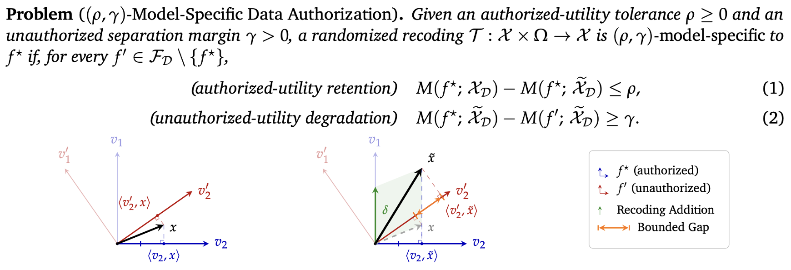
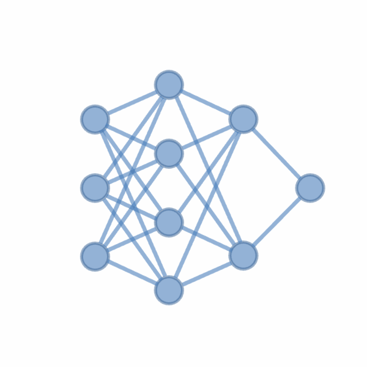
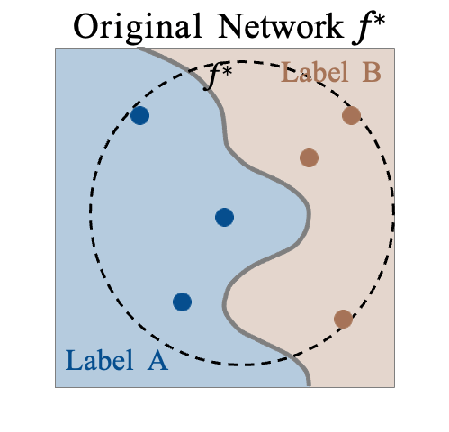
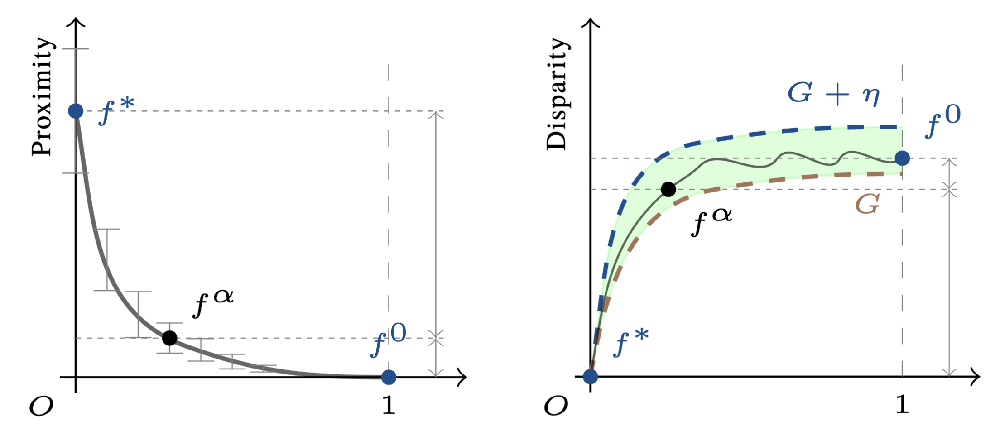
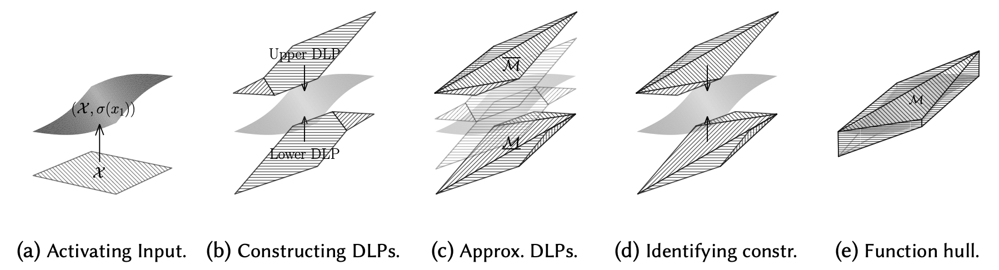

# About Me

I am a Research Fellow at the <a href="https://www.uq.edu.au/" target="_blank">University of Queensland</a>, previously a visiting scientist at <a href="https://www.csiro.au/" target="_blank">CSIRO</a>. My research focuses on <b>AI usage control</b>: technically enforcing how trained models and their training data can be reused, repurposed, or queried after release.

During my PhD at UQ, I was fortunate to be advised by A/Prof. <a href="https://baigd.github.io/" target="_blank">Guangdong Bai</a>, Dr. <a href="https://people.csiro.au/x/j/jason-xue" target="_blank">Jason Xue</a>, and Dr. <a href="https://www.linkedin.com/in/naipeng-dong-ab082a166/" target="_blank">Naipeng Dong</a>. I was funded by the Australian Government RTP Scholarship and the CSIRO Top-up Scholarship. I am a recipient of the 2024 <a href="https://eecs.uq.edu.au/article/2025/01/phd-student-awarded-prestigious-google-fellowship" target="_blank">Google PhD Fellowship</a> in Security, Privacy, and Abuse Prevention.

I serve on the program committees of top security conferences such as USENIX Security’27 and NDSS’27, and machine learning venues such as NeurIPS, ICLR, CVPR, and AAAI. I am also the HDR representative for the CSS discipline at UQ.

## News

- **[Sep. 2026]** 🏆 Catch-Only-One was accepted to NeurIPS’26 as an Oral (top 0.4%)!
- **[Sep. 2026]** 🏆 Our NTE work won the Best Paper Award (Runner-Up) at ECCV’26 LifeGenIP!
- **[Jul. 2026]** I will serve as a PC member for <a href="https://www.ndss-symposium.org/ndss2027" target="_blank"><u>NDSS’27</u></a> and <a href="https://www.usenix.org/conference/usenixsecurity27" target="_blank"><u>USENIX Security’27</u></a>.
- **[Apr. 2026]** Our paper on data privacy tracing has been accepted to IEEE TDSC’26.
- **[Mar. 2026]** Our paper on usage control has been accepted to IEEE EuroS&P’26.
- **[Feb. 2026]** I will serve as a reviewer for ECCV’26 and NeurIPS’26.
- **[Nov. 2025]** I will serve as a PC member for USENIX Security AE’26.
- **[Nov. 2025]** Our paper on GIA defense has been accepted to AsiaCCS’26.
- **[Sep. 2025]** I will serve as a reviewer for ICLR’26 and CVPR’26.
- **[Aug. 2025]** Our paper on NNV has been accepted to OOPSLA’25.
- **[Mar. 2025]** I will serve as a reviewer for IEEE TDSC, IEEE TIFS, and TSC.
- **[Jan. 2025]** Our paper on AI model modulation has been accepted to WWW’25.
- **[Oct. 2024]** 🏆 Awarded the <a href="https://research.google/programs-and-events/phd-fellowship/recipients/" target="_blank"><u>Google PhD Fellowship</u></a>!
- **[Oct. 2024]** I will serve as a PC member for PAKDD’25.
- **[Aug. 2024]** Our paper on GIA in language models has been accepted to ACM CCS’24.
- **[Mar. 2024]** Our paper on AI model usage control has been accepted to IEEE S&P’24.
- **[Feb. 2024]** Our paper on purpose limitation has been accepted to USENIX Security’24.
- **[Dec. 2023]** Our paper on deep data hiding has been accepted to IEEE TCSS.
- **[Oct. 2023]** Our paper on knowledge distillation has been accepted to WACV’24.
- **[Aug. 2023]** Our paper on formalizing LMs perturbation has been accepted to ICFEM’23.
- **[Dec. 2022]** Graduated with a B.CS (Adv.) from the University of Adelaide (2020–22).
- **[Nov. 2022]** 🏆 Presented at my first conference, <a href="/assets/img/22nips.webp" target="_blank"><u>NeurIPS</u></a>, in New Orleans!
- **[Sep. 2022]** Our paper on multi-modal model MIA has been accepted to NeurIPS’22.

## Selected Projects

  
Data Purpose Limitation (USENIX Security’24, NeurIPS’26)

  

  
Model Usage Control (S&P’24, WWW’25, Euro S&P’26)

  

    

      
      
      
    

  

  
Neural Network Verification (OOPSLA’25)

  

<!-- ## Invited Talks
- **[05/24]** *Neuron-level Usage Control for AI Models*, School of Computing, NUS. -->
<!-- 
 -->



